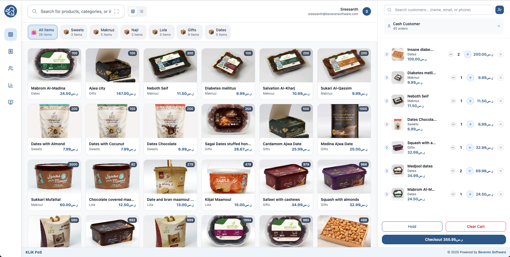
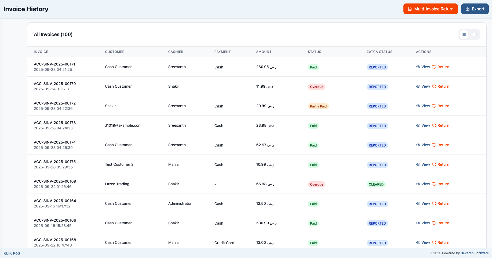

<div align="center">

# POS Mart

### A Modern Point of Sale Solution for ERPNext

[](https://opensource.org/licenses/MIT)
[](https://www.python.org/downloads/)
[](https://react.dev/)
[](https://www.typescriptlang.org/)
[](https://erpnext.com/)

<br />



<br />

**Fast. Modern. Compliant.**

[Features](#-key-features) • [Installation](#-installation) • [Configuration](#-configuration) • [Development](#-development) • [Contributing](#-contributing)

</div>

---

## Overview

**POS Mart** is a 100% open-source, modern Point of Sale application built for ERPNext. Designed for retail businesses that demand speed, compliance, and a seamless user experience, POS Mart transforms the checkout process with a beautiful, responsive interface.

Whether you're running a small retail shop or managing a large distribution network, POS Mart provides the tools you need to sell smarter and faster.

---

## Why POS Mart?

Traditional ERPNext POS solutions often lack modern UX design, miss critical compliance requirements, and don't integrate well with today's communication channels. POS Mart was built to solve these problems:

| Challenge | POS Mart Solution |
|-----------|-------------------|
| Poor user experience | Beautiful, responsive React-based UI |
| Tax compliance gaps | Built-in ZATCA compliance for Saudi Arabia |
| Limited communication | Native WhatsApp, Email & SMS integration |
| Slow checkout | Dedicated barcode scanner mode |
| Rigid business models | Flexible B2B, B2C, or hybrid modes |

---

## Key Features

### Core Functionality

- **Multi-Mode Sales** — Support for B2C (retail), B2B (wholesale), or hybrid business models
- **Smart Payments** — Multiple payment methods with automatic round-off handling
- **Barcode Scanner Mode** — Dedicated scanner-only mode for lightning-fast checkout
- **Customer Management** — Create and edit customers directly from the POS interface
- **Credit Notes** — Generate credit notes for single or multiple invoices

### Communication & Sharing

- **WhatsApp Integration** — Share invoices instantly via WhatsApp with approved templates
- **Email Support** — Send professional invoice emails with customizable templates
- **SMS Notifications** — Keep customers informed with SMS invoice delivery

### Compliance & Reporting

- **ZATCA Ready** — Full Phase 2 compliance for Saudi Arabian tax regulations
- **Thermal Printing** — Optimized print formats for thermal receipt printers
- **Delivery Tracking** — Track delivery personnel and delivery status

### User Experience

- **Responsive Design** — Works seamlessly on desktop, tablet, and mobile
- **List & Grid Views** — Choose your preferred item display mode
- **Offline Capable** — Continue operations even during network interruptions
- **Dark Mode Support** — Easy on the eyes during long shifts

---

## Tech Stack

<div align="center">

| Frontend | Backend | Build Tools |
|:--------:|:-------:|:-----------:|
| React 19 | Frappe Framework | Vite |
| TypeScript | Python 3.10+ | ESLint |
| Tailwind CSS | ERPNext v15+ | Ruff |
| Zustand | MariaDB/PostgreSQL | Pre-commit |

</div>

---

## Installation

### Prerequisites

- [Frappe Bench](https://frappeframework.com/docs/v15/user/en/installation) installed and configured
- ERPNext v15 or higher
- Python 3.10+
- Node.js 18+

### Quick Start

```bash
# Navigate to your bench directory
cd /path/to/frappe-bench

# Get the app
bench get-app https://github.com/ghimirerohan/pos-mart.git

# Install on your site
bench --site your-site.local install-app klik_pos

# Start the bench
bench start
```

### Access POS Mart

Once installed, access the POS at:
```
http://your-site:8000/klik_pos
```

---

## Configuration

After installation, configure POS Mart through the **POS Profile** settings in ERPNext.

### Essential Settings

| Setting | Description |
|---------|-------------|
| **Business Type** | Select B2C, B2B, or B2C & B2B based on your customer base |
| **POS Print Format** | Choose the receipt format (thermal printer recommended) |
| **Default View** | Set List View or Grid View for product display |
| **Email Template** | Select template for invoice emails |
| **WhatsApp Template** | Choose approved template for WhatsApp sharing |

### Optional Features

| Setting | Description |
|---------|-------------|
| **Use Scanner Fully** | Enable barcode-only item entry mode |
| **Hide Expected Amount** | Hide expected cash from cashiers during shift closing |
| **Enable WhatsApp** | Activate WhatsApp invoice sharing |
| **Enable SMS** | Activate SMS notifications |
| **Delivery Required** | Track delivery personnel for each sale |

<details>
<summary><strong>View Configuration Screenshots</strong></summary>

<br />

**POS Profile Settings:**


**WhatsApp Template Configuration:**


</details>

---

## ZATCA Compliance

POS Mart is fully compliant with Saudi Arabia's ZATCA (Zakat, Tax and Customs Authority) requirements for Phase 2 e-invoicing.

<div align="center">

</div>

### Supported Document Types

- B2C Simplified Tax Invoices
- B2B Standard Tax Invoices  
- Credit Notes (single and multi-invoice)

For full ZATCA integration, pair POS Mart with a compatible ZATCA integration app.

---

## Development

### Backend Development

```bash
# Clone and install
cd /path/to/frappe-bench/apps
git clone https://github.com/ghimirerohan/pos-mart.git klik_pos
cd klik_pos

# Install pre-commit hooks
pre-commit install

# Start development
cd /path/to/frappe-bench
bench start
```

### Frontend Development

```bash
# Navigate to SPA directory
cd /path/to/frappe-bench/apps/klik_pos/klik_spa

# Install dependencies
yarn install

# Start dev server with hot reload
yarn dev
```

The frontend dev server runs at `http://localhost:5173` with hot module replacement enabled.

### Project Structure

```
klik_pos/
├── klik_pos/              # Frappe app (Python backend)
│   ├── api/               # API endpoints
│   ├── klik_pos/          # DocTypes
│   │   └── doctype/       # Custom doctypes
│   ├── public/            # Static assets & built SPA
│   └── hooks.py           # Frappe hooks
├── klik_spa/              # React frontend (SPA)
│   ├── src/               # Source code
│   │   ├── components/    # React components
│   │   ├── hooks/         # Custom hooks
│   │   └── stores/        # Zustand stores
│   └── public/            # Static assets
└── docs/                  # Documentation & screenshots
```

---

## API Reference

POS Mart exposes several API endpoints for integration:

| Endpoint | Description |
|----------|-------------|
| `/api/method/klik_pos.api.item.*` | Item management |
| `/api/method/klik_pos.api.customer.*` | Customer operations |
| `/api/method/klik_pos.api.sales_invoice.*` | Invoice handling |
| `/api/method/klik_pos.api.payment.*` | Payment processing |
| `/api/method/klik_pos.api.pos_entry.*` | POS session management |

---

## Contributing

We welcome contributions! Here's how to get started:

1. **Fork** the repository
2. **Create** a feature branch (`git checkout -b feature/amazing-feature`)
3. **Commit** your changes (`git commit -m 'Add amazing feature'`)
4. **Push** to the branch (`git push origin feature/amazing-feature`)
5. **Open** a Pull Request

### Code Standards

- Python: Formatted with [Ruff](https://github.com/astral-sh/ruff)
- JavaScript/TypeScript: ESLint configuration included
- Pre-commit hooks enforce code quality

```bash
# Install pre-commit hooks
pre-commit install
```

---

## License

This project is licensed under the **MIT License** — see the [LICENSE](license.txt) file for details.

---

## Support

- **Issues**: [GitHub Issues](https://github.com/ghimirerohan/pos-mart/issues)
- **Discussions**: [GitHub Discussions](https://github.com/ghimirerohan/pos-mart/discussions)

---

<div align="center">

**Built with modern tools for modern retail**

Made with React, TypeScript, and Frappe Framework

</div>
